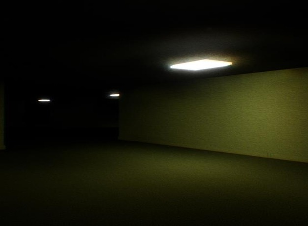
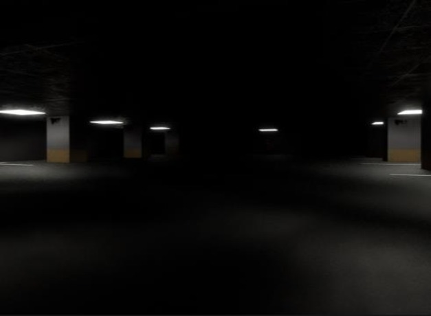
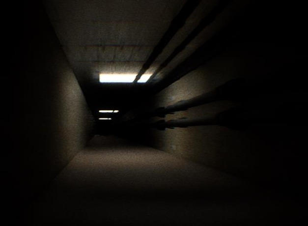
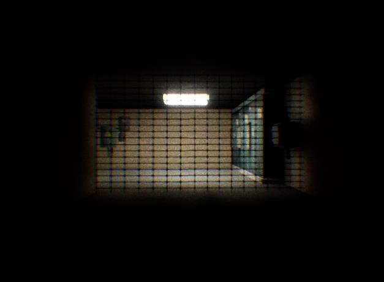
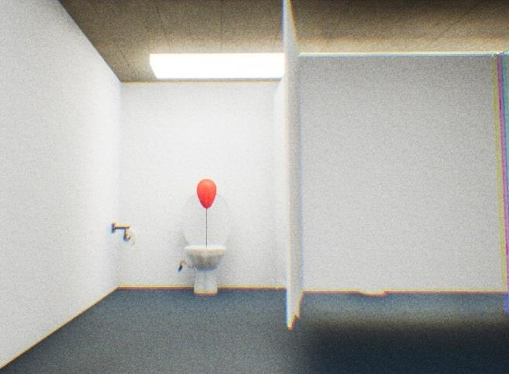

# 🟨 Backrooms – UE4 Horror Game  
*Graduation Project (2022/2023)*

Inspired by the Backrooms internet lore: endless yellow halls, strange entities, and the illusion of escape.  
This game was created solo in Unreal Engine 4 using Blueprints and free assets.

*The current version on the repository is optimized for Unreal Engine 5.3, as newer versions introduce issues with Emissive lighting.*

---

## 📜 Story Summary

- Player must escape **5 levels** of the Backrooms.
- Each level contains **letters** (9 total) with clues and hidden messages by the author to help the player escape.
- Final level leads to the **author's office** showing surveillance feeds of each level, where you read his final letter...

---

## 🔽 Levels Breakdown

| Level                                | Preview                       |
| ------------------------------------ | ----------------------------- |
| **Level 0** — *The Lobby*            |  |
| **Level 1** — *Parking Zone*         |  |
| **Level 2** — *Pipe Dream*           |  |
| **Level 3** — *Electrical Station*   |  |
| **Level 4** — *The Abandoned Office* |  |

---

## 🛠️ Technologies & Contributions

- Engine: Originally: **Unreal Engine 4**, Now: **Unreal Engine 5.3** (Blueprints only)
- Assets: Free models (Sketchfab), Audio (Freesound)
- Tools: Photoshop for graphic design
- Solo-developed (gameplay, logic, level design)

---

## 🧠 Final Notes

This game was a **non-commercial student project**. It was never released due to use of unlicensed assets, but it serves as a full showcase of my work in game development and horror design.
